# Happy Path

[](https://pawamoy.github.io/happy-path/)
[](https://gitpod.io/#https://github.com/pawamoy/happy-path)
[](https://app.gitter.im/#/room/#happy-path:gitter.im)

Code and data flow visualization tool for Python.

## Installation

This project is available to sponsors only, through my Insiders program.
See Insiders [explanation](https://pawamoy.github.io/happy-path/insiders/)
and [installation instructions](https://pawamoy.github.io/happy-path/insiders/installation/).

## Development notes

- [x] Exploration: Use `code2flow some_py_files.py` to generate an `out.gv` file, which is `dot` input
- [x] Exploration: Use `dot -Tsvg out.gv -o out.svg` to generate an SVG graph. Open it in a browser to visualize.
- [ ] Todo: Get inspiration from the dot files generated by `code2flow` to generate our own call graphs in `dot` format from our recorded events
- [x] Todo: Find a way to animate a shape moving on an edge between two nodes, from A to middle, and from middle to B (two steps)
- [ ] Define algorithm


## Algorithm

1. Record events in JSON.
2. Build call graph: nodes, edges, and clusters (if possible in one pass).
3. Build `dot` script.
4. Convert `dot` script to SVG.
5. Build events data array (Javascript).
6. Output SVG + events array + Javascript controls.

## JSON events example

```json
{
    "event": "call",
    "caller": {
        "name": "griffe.loader.GriffeLoader.load",
        "source": {
            "path": "/media/data/dev/insiders/happy-path/__pypackages__/3.11/lib/griffe/loader.py",
            "lineno": 181
        },
        "locals": {
            "self": "<griffe.loader.GriffeLoader object at 0x70366ad64e90>",
            "objspec": "griffe",
            "submodules": true,
            "try_relative_path": true,
            "find_stubs_package": false,
            "module": null
        }
    },
    "callee": {
        "name": "griffe.finder.ModuleFinder.find_spec",
        "source": {
            "path":"/media/data/dev/insiders/happy-path/__pypackages__/3.11/lib/griffe/finder.py",
            "lineno": 134
        },
        "locals": {
            "self": "<griffe.finder.ModuleFinder object at 0x70366ae6dfd0>",
            "module": "griffe",
            "try_relative_path": true,
            "find_stubs_package": false
        }
    }
}
```

## Dot script example

```dot
digraph G {
    concentrate = true;
    splines = "ortho";
    rankdir = "LR";

    subgraph legend{
        rank = min;
        label = "legend";
        Legend [shape=none, margin=0, label = <
            <table cellspacing="0" cellpadding="0" border="1"><tr><td>Code2flow Legend</td></tr><tr><td>
            <table cellspacing="0">
            <tr><td>Regular function</td><td width="50px" bgcolor='#cccccc'></td></tr>
            <tr><td>Trunk function (nothing calls this)</td><td bgcolor='#966F33'></td></tr>
            <tr><td>Leaf function (this calls nothing else)</td><td bgcolor='#6db33f'></td></tr>
            <tr><td>Function call</td><td><font color='black'>&#8594;</font></td></tr>
            </table></td></tr></table>
        >];
    }
    
    node_e32a87e2 [label="0: (global)()" name="__main__::(global)" shape="rect" style="rounded,filled" fillcolor="#966F33" ];
    node_0449ea5e [label="54: write()" name="cli::GzipWriter.write" shape="rect" style="rounded,filled" fillcolor="#cccccc" ];
    node_87a06b92 [label="30: __init__()" name="cli::_DebugInfo.__init__" shape="rect" style="rounded,filled" fillcolor="#cccccc" ];
    node_c63f4444 [label="38: get_parser()" name="cli::get_parser" shape="rect" style="rounded,filled" fillcolor="#6db33f" ];
    node_744b00ec [label="68: main()" name="cli::main" shape="rect" style="rounded,filled" fillcolor="#cccccc" ];
    node_7ded1a59 [label="59: output()" name="cli::output" shape="rect" style="rounded,filled" fillcolor="#6db33f" ];
    node_68d17f3c [label="0: (global)()" name="debug::(global)" shape="rect" style="rounded,filled" fillcolor="#966F33" ];
    node_54a71244 [label="48: _interpreter_name_version()" name="debug::_interpreter_name_version" shape="rect" style="rounded,filled" fillcolor="#6db33f" ];
    node_3aa3fc0f [label="74: get_debug_info()" name="debug::get_debug_info" shape="rect" style="rounded,filled" fillcolor="#cccccc" ];
    node_a784781d [label="59: get_version()" name="debug::get_version" shape="rect" style="rounded,filled" fillcolor="#6db33f" ];
    node_2fd62a0e [label="92: print_debug_info()" name="debug::print_debug_info" shape="rect" style="rounded,filled" fillcolor="#cccccc" ];
    node_8fdaef28 [label="78: profile()" name="profiler::profile" shape="rect" style="rounded,filled" fillcolor="#6db33f" ];

    node_e32a87e2 -> node_744b00ec [color="#56B4E9" penwidth="2"];
    node_0449ea5e -> node_0449ea5e [color="#D55E00" penwidth="2"];
    node_87a06b92 -> node_87a06b92 [color="#56B4E9" penwidth="2"];
    node_744b00ec -> node_c63f4444 [color="#F0E442" penwidth="2"];
    node_744b00ec -> node_7ded1a59 [color="#F0E442" penwidth="2"];
    node_744b00ec -> node_8fdaef28 [color="#F0E442" penwidth="2"];
    node_68d17f3c -> node_2fd62a0e [color="#F0E442" penwidth="2"];
    node_3aa3fc0f -> node_54a71244 [color="#CC79A7" penwidth="2"];
    node_3aa3fc0f -> node_a784781d [color="#CC79A7" penwidth="2"];
    node_2fd62a0e -> node_3aa3fc0f [color="#D55E00" penwidth="2"];

    subgraph cluster_a0191103 {
        node_e32a87e2;
        label="File: __main__";
        name="__main__";
        style="filled";
        graph[style=dotted];
    };

    subgraph cluster_9febe9f8 {
        node_c63f4444 node_7ded1a59 node_744b00ec;
        label="File: cli";
        name="cli";
        style="filled";
        graph[style=dotted];

        subgraph cluster_570e2207 {
            node_87a06b92;
            label="Class: _DebugInfo";
            name="_DebugInfo";
            style="filled";
            graph[style=dotted];
        };

        subgraph cluster_a8cd20c8 {
            node_0449ea5e;
            label="Class: GzipWriter";
            name="GzipWriter";
            style="filled";
            graph[style=dotted];
        };
    };

    subgraph cluster_fb8668f8 {
        node_54a71244 node_a784781d node_3aa3fc0f node_2fd62a0e node_68d17f3c;
        label="File: debug";
        name="debug";
        style="filled";
        graph[style=dotted];
    };

    subgraph cluster_4ef951e5 {
        node_8fdaef28;
        label="File: profiler";
        name="profiler";
        style="filled";
        graph[style=dotted];
    };
}
```



## SVG example

```html
<svg width="1038pt" height="531pt"
 viewBox="0.00 0.00 1037.75 531.00" xmlns="http://www.w3.org/2000/svg" xmlns:xlink="http://www.w3.org/1999/xlink">
    <g id="graph0" class="graph" transform="scale(1 1) rotate(0) translate(4 527)">
        <title>G</title>
        <polygon fill="white" stroke="none" points="-4,4 -4,-527 1033.75,-527 1033.75,4 -4,4"/>
        <g id="clust2" class="cluster">
            <title>cluster_a0191103</title>
            <polygon fill="none" stroke="black" stroke-dasharray="1,5" points="105.75,-299 105.75,-376 220.25,-376 220.25,-299 105.75,-299"/>
            <text text-anchor="middle" x="163" y="-358.7" font-family="Times,serif" font-size="14.00">File: __main__</text>
        </g>
        <g id="clust3" class="cluster">
            <title>cluster_9febe9f8</title>
            <polygon fill="none" stroke="black" stroke-dasharray="1,5" points="369.5,-93 369.5,-376 725.25,-376 725.25,-93 369.5,-93"/>
            <text text-anchor="middle" x="547.38" y="-358.7" font-family="Times,serif" font-size="14.00">File: cli</text>
        </g>
        <g id="clust4" class="cluster">
            <title>cluster_570e2207</title>
            <polygon fill="none" stroke="black" stroke-dasharray="1,5" points="377.5,-101 377.5,-196 521,-196 521,-101 377.5,-101"/>
            <text text-anchor="middle" x="449.25" y="-178.7" font-family="Times,serif" font-size="14.00">Class: _DebugInfo</text>
        </g>
        <g id="clust5" class="cluster">
            <title>cluster_a8cd20c8</title>
            <polygon fill="none" stroke="black" stroke-dasharray="1,5" points="378.25,-204 378.25,-299 519.25,-299 519.25,-204 378.25,-204"/>
            <text text-anchor="middle" x="448.75" y="-281.7" font-family="Times,serif" font-size="14.00">Class: GzipWriter</text>
        </g>
        <g id="clust6" class="cluster">
            <title>cluster_fb8668f8</title>
            <polygon fill="none" stroke="black" stroke-dasharray="1,5" points="105.75,-384 105.75,-515 1021.75,-515 1021.75,-384 105.75,-384"/>
            <text text-anchor="middle" x="563.75" y="-497.7" font-family="Times,serif" font-size="14.00">File: debug</text>
        </g>
        <g id="clust7" class="cluster">
            <title>cluster_4ef951e5</title>
            <polygon fill="none" stroke="black" stroke-dasharray="1,5" points="594.62,-8 594.62,-85 709.88,-85 709.88,-8 594.62,-8"/>
            <text text-anchor="middle" x="652.25" y="-67.7" font-family="Times,serif" font-size="14.00">File: profiler</text>
        </g>
        <!-- Legend -->
        <g id="node1" class="node">
            <title>Legend</title>
            <polygon fill="none" stroke="black" points="1,-268.38 1,-287.62 325,-287.62 325,-268.38 1,-268.38"/>
            <text text-anchor="start" x="97.38" y="-273.32" font-family="Times,serif" font-size="14.00">Code2flow Legend</text>
            <polygon fill="none" stroke="black" points="1,-172.38 1,-268.38 325,-268.38 325,-172.38 1,-172.38"/>
            <polygon fill="none" stroke="black" points="3,-243.38 3,-266.38 273,-266.38 273,-243.38 3,-243.38"/>
            <text text-anchor="start" x="78.38" y="-250.07" font-family="Times,serif" font-size="14.00">Regular function</text>
            <polygon fill="#cccccc" stroke="none" points="273,-243.38 273,-266.38 323,-266.38 323,-243.38 273,-243.38"/>
            <polygon fill="none" stroke="black" points="273,-243.38 273,-266.38 323,-266.38 323,-243.38 273,-243.38"/>
            <polygon fill="none" stroke="black" points="3,-220.38 3,-243.38 273,-243.38 273,-220.38 3,-220.38"/>
            <text text-anchor="start" x="16.5" y="-227.07" font-family="Times,serif" font-size="14.00">Trunk function (nothing calls this)</text>
            <polygon fill="#966f33" stroke="none" points="273,-220.38 273,-243.38 323,-243.38 323,-220.38 273,-220.38"/>
            <polygon fill="none" stroke="black" points="273,-220.38 273,-243.38 323,-243.38 323,-220.38 273,-220.38"/>
            <polygon fill="none" stroke="black" points="3,-197.38 3,-220.38 273,-220.38 273,-197.38 3,-197.38"/>
            <text text-anchor="start" x="5.62" y="-204.07" font-family="Times,serif" font-size="14.00">Leaf function (this calls nothing else)</text>
            <polygon fill="#6db33f" stroke="none" points="273,-197.38 273,-220.38 323,-220.38 323,-197.38 273,-197.38"/>
            <polygon fill="none" stroke="black" points="273,-197.38 273,-220.38 323,-220.38 323,-197.38 273,-197.38"/>
            <polygon fill="none" stroke="black" points="3,-174.38 3,-197.38 273,-197.38 273,-174.38 3,-174.38"/>
            <text text-anchor="start" x="91.88" y="-181.07" font-family="Times,serif" font-size="14.00">Function call</text>
            <polygon fill="none" stroke="black" points="273,-174.38 273,-197.38 323,-197.38 323,-174.38 273,-174.38"/>
            <text text-anchor="start" x="292" y="-181.07" font-family="Times,serif" font-size="14.00">→</text>
            <polygon fill="none" stroke="black" points="2,-173.38 2,-267.38 324,-267.38 324,-173.38 2,-173.38"/>
            <polygon fill="none" stroke="black" points="0,-171.38 0,-288.62 326,-288.62 326,-171.38 0,-171.38"/>
        </g>
        <!-- node_e32a87e2 -->
        <g id="node2" class="node">
            <title>node_e32a87e2</title>
            <path fill="#966f33" stroke="black" d="M200.25,-343C200.25,-343 125.75,-343 125.75,-343 119.75,-343 113.75,-337 113.75,-331 113.75,-331 113.75,-319 113.75,-319 113.75,-313 119.75,-307 125.75,-307 125.75,-307 200.25,-307 200.25,-307 206.25,-307 212.25,-313 212.25,-319 212.25,-319 212.25,-331 212.25,-331 212.25,-337 206.25,-343 200.25,-343"/>
            <text text-anchor="middle" x="163" y="-320.32" font-family="Times,serif" font-size="14.00">0: (global)()</text>
        </g>
        <!-- node_744b00ec -->
        <g id="node6" class="node">
            <title>node_744b00ec</title>
            <path fill="#cccccc" stroke="black" d="M481.12,-343C481.12,-343 416.38,-343 416.38,-343 410.38,-343 404.38,-337 404.38,-331 404.38,-331 404.38,-319 404.38,-319 404.38,-313 410.38,-307 416.38,-307 416.38,-307 481.12,-307 481.12,-307 487.12,-307 493.12,-313 493.12,-319 493.12,-319 493.12,-331 493.12,-331 493.12,-337 487.12,-343 481.12,-343"/>
            <text text-anchor="middle" x="448.75" y="-320.32" font-family="Times,serif" font-size="14.00">68: main()</text>
        </g>
        <!-- node_e32a87e2&#45;&gt;node_744b00ec -->
        <g id="edge1" class="edge">
            <title>node_e32a87e2&#45;&gt;node_744b00ec</title>
            <path id="edge1-path" fill="none" stroke="#56b4e9" stroke-width="2" d="M212.45,-325C212.45,-325 391.11,-325 391.11,-325"/>
            <polygon fill="#56b4e9" stroke="#56b4e9" stroke-width="2" points="391.11,-328.5 401.11,-325 391.11,-321.5 391.11,-328.5"/>
        </g>
        <!-- node_0449ea5e -->
        <g id="node3" class="node">
            <title>node_0449ea5e</title>
            <path fill="#cccccc" stroke="black" d="M482.25,-248C482.25,-248 415.25,-248 415.25,-248 409.25,-248 403.25,-242 403.25,-236 403.25,-236 403.25,-224 403.25,-224 403.25,-218 409.25,-212 415.25,-212 415.25,-212 482.25,-212 482.25,-212 488.25,-212 494.25,-218 494.25,-224 494.25,-224 494.25,-236 494.25,-236 494.25,-242 488.25,-248 482.25,-248"/>
            <text text-anchor="middle" x="448.75" y="-225.32" font-family="Times,serif" font-size="14.00">54: write()</text>
        </g>
        <!-- node_0449ea5e&#45;&gt;node_0449ea5e -->
        <g id="edge2" class="edge">
            <title>node_0449ea5e&#45;&gt;node_0449ea5e</title>
            <path id="edge2-path" fill="none" stroke="#d55e00" stroke-width="2" d="M402.97,-230C393.19,-230 385.75,-230 385.75,-230 385.75,-230 385.75,-191.69 385.75,-191.69 385.75,-191.69 524.75,-191.69 524.75,-191.69 524.75,-191.69 524.75,-230 524.75,-230 524.75,-230 507.74,-230 507.74,-230"/>
            <polygon fill="#d55e00" stroke="#d55e00" stroke-width="2" points="507.74,-226.5 497.74,-230 507.74,-233.5 507.74,-226.5"/>
        </g>
        <!-- node_87a06b92 -->
        <g id="node4" class="node">
            <title>node_87a06b92</title>
            <path fill="#cccccc" stroke="black" d="M489,-145C489,-145 408.5,-145 408.5,-145 402.5,-145 396.5,-139 396.5,-133 396.5,-133 396.5,-121 396.5,-121 396.5,-115 402.5,-109 408.5,-109 408.5,-109 489,-109 489,-109 495,-109 501,-115 501,-121 501,-121 501,-133 501,-133 501,-139 495,-145 489,-145"/>
            <text text-anchor="middle" x="448.75" y="-122.33" font-family="Times,serif" font-size="14.00">30: __init__()</text>
        </g>
        <!-- node_87a06b92&#45;&gt;node_87a06b92 -->
        <g id="edge3" class="edge">
            <title>node_87a06b92&#45;&gt;node_87a06b92</title>
            <path id="edge3-path" fill="none" stroke="#56b4e9" stroke-width="2" d="M396.25,-127C383.65,-127 373.75,-127 373.75,-127 373.75,-127 373.75,-158.19 373.75,-158.19 373.75,-158.19 512.75,-158.19 512.75,-158.19 512.75,-158.19 512.75,-127 512.75,-127 512.75,-127 511.61,-127 511.61,-127"/>
            <polygon fill="#56b4e9" stroke="#56b4e9" stroke-width="2" points="514.34,-123.5 504.34,-127 514.34,-130.5 514.34,-123.5"/>
        </g>
        <!-- node_c63f4444 -->
        <g id="node5" class="node">
            <title>node_c63f4444</title>
            <path fill="#6db33f" stroke="black" d="M705.25,-289C705.25,-289 599.25,-289 599.25,-289 593.25,-289 587.25,-283 587.25,-277 587.25,-277 587.25,-265 587.25,-265 587.25,-259 593.25,-253 599.25,-253 599.25,-253 705.25,-253 705.25,-253 711.25,-253 717.25,-259 717.25,-265 717.25,-265 717.25,-277 717.25,-277 717.25,-283 711.25,-289 705.25,-289"/>
            <text text-anchor="middle" x="652.25" y="-266.32" font-family="Times,serif" font-size="14.00">38: get_parser()</text>
        </g>
        <!-- node_744b00ec&#45;&gt;node_c63f4444 -->
        <g id="edge4" class="edge">
            <title>node_744b00ec&#45;&gt;node_c63f4444</title>
            <path id="edge4-path" fill="none" stroke="#f0e442" stroke-width="2" d="M493.35,-325C536.28,-325 594.75,-325 594.75,-325 594.75,-325 594.75,-302.31 594.75,-302.31"/>
            <polygon fill="#f0e442" stroke="#f0e442" stroke-width="2" points="598.25,-302.31 594.75,-292.31 591.25,-302.31 598.25,-302.31"/>
        </g>
        <!-- node_7ded1a59 -->
        <g id="node7" class="node">
            <title>node_7ded1a59</title>
            <path fill="#6db33f" stroke="black" d="M690.62,-343C690.62,-343 613.88,-343 613.88,-343 607.88,-343 601.88,-337 601.88,-331 601.88,-331 601.88,-319 601.88,-319 601.88,-313 607.88,-307 613.88,-307 613.88,-307 690.62,-307 690.62,-307 696.62,-307 702.62,-313 702.62,-319 702.62,-319 702.62,-331 702.62,-331 702.62,-337 696.62,-343 690.62,-343"/>
            <text text-anchor="middle" x="652.25" y="-320.32" font-family="Times,serif" font-size="14.00">59: output()</text>
        </g>
        <!-- node_744b00ec&#45;&gt;node_7ded1a59 -->
        <g id="edge5" class="edge">
            <title>node_744b00ec&#45;&gt;node_7ded1a59</title>
            <path id="edge5-path" fill="none" stroke="#f0e442" stroke-width="2" d="M493.41,-334C493.41,-334 588.58,-334 588.58,-334"/>
            <polygon fill="#f0e442" stroke="#f0e442" stroke-width="2" points="588.58,-337.5 598.58,-334 588.58,-330.5 588.58,-337.5"/>
        </g>
        <!-- node_8fdaef28 -->
        <g id="node13" class="node">
            <title>node_8fdaef28</title>
            <path fill="#6db33f" stroke="black" d="M689.88,-52C689.88,-52 614.62,-52 614.62,-52 608.62,-52 602.62,-46 602.62,-40 602.62,-40 602.62,-28 602.62,-28 602.62,-22 608.62,-16 614.62,-16 614.62,-16 689.88,-16 689.88,-16 695.88,-16 701.88,-22 701.88,-28 701.88,-28 701.88,-40 701.88,-40 701.88,-46 695.88,-52 689.88,-52"/>
            <text text-anchor="middle" x="652.25" y="-29.32" font-family="Times,serif" font-size="14.00">78: profile()</text>
        </g>
        <!-- node_744b00ec&#45;&gt;node_8fdaef28 -->
        <g id="edge6" class="edge">
            <title>node_744b00ec&#45;&gt;node_8fdaef28</title>
            <path id="edge6-path" fill="none" stroke="#f0e442" stroke-width="2" d="M493.47,-316C531.42,-316 579.75,-316 579.75,-316 579.75,-316 579.75,-34 579.75,-34 579.75,-34 589.26,-34 589.26,-34"/>
            <polygon fill="#f0e442" stroke="#f0e442" stroke-width="2" points="589.26,-37.5 599.26,-34 589.26,-30.5 589.26,-37.5"/>
        </g>
        <!-- node_68d17f3c -->
        <g id="node8" class="node">
            <title>node_68d17f3c</title>
            <path fill="#966f33" stroke="black" d="M200.25,-455C200.25,-455 125.75,-455 125.75,-455 119.75,-455 113.75,-449 113.75,-443 113.75,-443 113.75,-431 113.75,-431 113.75,-425 119.75,-419 125.75,-419 125.75,-419 200.25,-419 200.25,-419 206.25,-419 212.25,-425 212.25,-431 212.25,-431 212.25,-443 212.25,-443 212.25,-449 206.25,-455 200.25,-455"/>
            <text text-anchor="middle" x="163" y="-432.32" font-family="Times,serif" font-size="14.00">0: (global)()</text>
        </g>
        <!-- node_2fd62a0e -->
        <g id="node12" class="node">
            <title>node_2fd62a0e</title>
            <path fill="#cccccc" stroke="black" d="M523.5,-455C523.5,-455 374,-455 374,-455 368,-455 362,-449 362,-443 362,-443 362,-431 362,-431 362,-425 368,-419 374,-419 374,-419 523.5,-419 523.5,-419 529.5,-419 535.5,-425 535.5,-431 535.5,-431 535.5,-443 535.5,-443 535.5,-449 529.5,-455 523.5,-455"/>
            <text text-anchor="middle" x="448.75" y="-432.32" font-family="Times,serif" font-size="14.00">92: print_debug_info()</text>
        </g>
        <!-- node_68d17f3c&#45;&gt;node_2fd62a0e -->
        <g id="edge7" class="edge">
            <title>node_68d17f3c&#45;&gt;node_2fd62a0e</title>
            <path id="edge7-path" fill="none" stroke="#f0e442" stroke-width="2" d="M212.45,-437C212.45,-437 348.53,-437 348.53,-437"/>
            <polygon fill="#f0e442" stroke="#f0e442" stroke-width="2" points="348.53,-440.5 358.53,-437 348.53,-433.5 348.53,-440.5"/>
        </g>
        <!-- node_54a71244 -->
        <g id="node9" class="node">
            <title>node_54a71244</title>
            <path fill="#6db33f" stroke="black" d="M1001.75,-428C1001.75,-428 781,-428 781,-428 775,-428 769,-422 769,-416 769,-416 769,-404 769,-404 769,-398 775,-392 781,-392 781,-392 1001.75,-392 1001.75,-392 1007.75,-392 1013.75,-398 1013.75,-404 1013.75,-404 1013.75,-416 1013.75,-416 1013.75,-422 1007.75,-428 1001.75,-428"/>
            <text text-anchor="middle" x="891.38" y="-405.32" font-family="Times,serif" font-size="14.00">48: _interpreter_name_version()</text>
        </g>
        <!-- node_3aa3fc0f -->
        <g id="node10" class="node">
            <title>node_3aa3fc0f</title>
            <path fill="#cccccc" stroke="black" d="M721,-455C721,-455 583.5,-455 583.5,-455 577.5,-455 571.5,-449 571.5,-443 571.5,-443 571.5,-431 571.5,-431 571.5,-425 577.5,-419 583.5,-419 583.5,-419 721,-419 721,-419 727,-419 733,-425 733,-431 733,-431 733,-443 733,-443 733,-449 727,-455 721,-455"/>
            <text text-anchor="middle" x="652.25" y="-432.32" font-family="Times,serif" font-size="14.00">74: get_debug_info()</text>
        </g>
        <!-- node_3aa3fc0f&#45;&gt;node_54a71244 -->
        <g id="edge8" class="edge">
            <title>node_3aa3fc0f&#45;&gt;node_54a71244</title>
            <path id="edge8-path" fill="none" stroke="#cc79a7" stroke-width="2" d="M733.21,-423.5C733.21,-423.5 755.84,-423.5 755.84,-423.5"/>
            <polygon fill="#cc79a7" stroke="#cc79a7" stroke-width="2" points="755.84,-427 765.84,-423.5 755.84,-420 755.84,-427"/>
        </g>
        <!-- node_a784781d -->
        <g id="node11" class="node">
            <title>node_a784781d</title>
            <path fill="#6db33f" stroke="black" d="M947.38,-482C947.38,-482 835.38,-482 835.38,-482 829.38,-482 823.38,-476 823.38,-470 823.38,-470 823.38,-458 823.38,-458 823.38,-452 829.38,-446 835.38,-446 835.38,-446 947.38,-446 947.38,-446 953.38,-446 959.38,-452 959.38,-458 959.38,-458 959.38,-470 959.38,-470 959.38,-476 953.38,-482 947.38,-482"/>
            <text text-anchor="middle" x="891.38" y="-459.32" font-family="Times,serif" font-size="14.00">59: get_version()</text>
        </g>
        <!-- node_3aa3fc0f&#45;&gt;node_a784781d -->
        <g id="edge9" class="edge">
            <title>node_3aa3fc0f&#45;&gt;node_a784781d</title>
            <path id="edge9-path" fill="none" stroke="#cc79a7" stroke-width="2" d="M733.21,-450.5C733.21,-450.5 810.22,-450.5 810.22,-450.5"/>
            <polygon fill="#cc79a7" stroke="#cc79a7" stroke-width="2" points="810.22,-454 820.22,-450.5 810.22,-447 810.22,-454"/>
        </g>
        <!-- node_2fd62a0e&#45;&gt;node_3aa3fc0f -->
        <g id="edge10" class="edge">
            <title>node_2fd62a0e&#45;&gt;node_3aa3fc0f</title>
            <path id="edge10-path" fill="none" stroke="#d55e00" stroke-width="2" d="M535.94,-437C535.94,-437 558.02,-437 558.02,-437"/>
            <polygon fill="#d55e00" stroke="#d55e00" stroke-width="2" points="558.02,-440.5 568.02,-437 558.02,-433.5 558.02,-440.5"/>
        </g>
        <circle id="movingCircle" r="10" fill="green"></circle>
        <circle id="startCircle" r="10" fill="green"></circle>
        <circle id="endCircle" r="10" fill="blue"></circle>
    </g>
</svg>
```